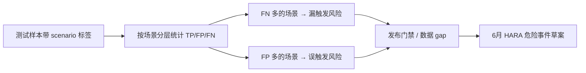

# 2026年5月AI基础概念与安全风险执行包

## 1. 本月定位

本文件是 `12-2026年度双轨学习与能力建设计划书.md` 中“2026年5月计划”的具体实现。

5月主题：

**双轨路线校准 + AI基础概念补齐。**

本月目标不是深入算法实现，而是建立后续做智驾AI安全、SOTIF、AI Safety、机器人/具身智能安全时必须具备的基础语言。

本月要达成的能力：

- 能理解AI模型基本评估概念。
- 能把模型指标和安全风险联系起来。
- 能解释为什么平均指标不能直接证明安全。
- 能把AEB漏触发/误触发映射到 `FN/FP`，并理解 `TP/FP/FN/TN` 的完整含义。
- 能把机器人避障失败映射到 `FN/FP`，同时知道 `TN` 在安全分析中的作用。
- 能初步判断数据泄漏、OOD、分布偏移为什么会破坏安全证据。
- 能按场景分层解释模型风险（不只报总体 mAP/Recall，能指出关键场景的 FN/FP 与发布结论，见 **§13.7**）。

## 2. 本月交付物清单


| 编号     | 交付物               | 状态     |
| ------ | ----------------- | ------ |
| M05-01 | AI模型基础概念与安全风险对照表  | 已在本文建立 |
| M05-02 | 模型指标到安全证据映射表      | 已在本文建立 |
| M05-03 | AEB FN/FP安全风险说明   | 已在本文建立 |
| M05-04 | 为什么mAP提升不等于AEB更安全 | 已在本文建立 |
| M05-05 | 机器人避障FN/FP安全风险说明  | 已在本文建立 |
| M05-06 | 5月验收问答            | 已在本文建立 |


## 3. AI模型基础概念与安全风险对照表

### 3.1 数据集相关概念


| 概念      | 含义                | 安全风险                  | 需要追问的问题                 |
| ------- | ----------------- | --------------------- | ----------------------- |
| 训练集     | 用于训练模型参数的数据       | 训练数据不覆盖关键场景，模型在真实场景失效 | 训练集是否覆盖目标ODD和高风险场景？     |
| 验证集     | 用于模型选择、调参和中间评估的数据 | 如果验证集与测试集混用，会导致评估结果虚高 | 验证集是否独立？是否被反复用于调参？      |
| 测试集     | 用于最终独立评估模型的数据     | 测试集不独立或被污染，安全证据不可信    | 测试集是否从未参与训练和调参？         |
| 回归测试集   | 用于确认新模型没有破坏旧能力的数据 | 增训后旧场景退化但未被发现         | 是否包含历史高风险失败场景？          |
| 安全关键场景集 | 针对高风险场景建立的专项数据集   | 平均指标提升掩盖关键场景失败        | 夜间、雨雾、遮挡、cut-in等是否单独评估？ |
| 长尾场景集   | 覆盖低频但高风险场景的数据集    | 模型在少见场景下失效            | 长尾目标、异形目标、特殊交通参与者是否覆盖？  |


### 3.2 数据质量相关概念


| 概念     | 含义               | 安全风险               | 需要追问的问题                 |
| ------ | ---------------- | ------------------ | ----------------------- |
| 数据准确性  | 数据内容和标注是否正确      | 错误标注会让模型学到错误模式     | 标注抽检通过率是多少？             |
| 数据完整性  | 数据字段、标签、场景信息是否完整 | 缺少关键标签，无法做安全分层评估   | 是否有目标类型、遮挡、光照、天气、速度等标签？ |
| 数据代表性  | 数据是否能代表目标ODD或操作域 | 数据集中常规场景多，真实高风险场景少 | 数据分布是否与真实运行分布一致？        |
| 数据一致性  | 不同标注员、不同批次规则是否一致 | 标注规则不一致导致模型学习混乱    | 是否有统一标注规范和一致性检查？        |
| 数据可追溯性 | 数据能否追踪来源、版本、标注批次 | 出现事故后无法证明模型依据和验证过程 | 数据是否能追溯到采集来源和模型版本？      |


### 3.3 模型泛化相关概念


| 概念   | 含义                 | 安全风险            | 需要追问的问题                |
| ---- | ------------------ | --------------- | ---------------------- |
| 过拟合  | 模型在训练集表现好，在新数据上表现差 | 测试或实车中性能突然下降    | 是否有独立测试集和跨场景验证？        |
| 欠拟合  | 模型能力不足，训练集和测试集都表现差 | 基础识别能力不足        | 是否模型容量、数据质量或训练过程有问题？   |
| 泛化能力 | 模型面对新场景的适应能力       | 真实道路或真实机器人环境中失效 | 是否做过新城市、新天气、新场景验证？     |
| 分布偏移 | 训练分布与真实运行分布不同      | 模型在真实用户环境下失效    | 运行期间是否监控数据分布变化？        |
| OOD  | 输入超出训练分布或操作域       | 模型自信输出错误结果      | OOD是否能识别？识别后是否降级或请求确认？ |


### 3.4 指标相关概念


| 概念                | 含义                    | 安全风险               | 安全关注点                             |
| ----------------- | --------------------- | ------------------ | --------------------------------- |
| TP，True Positive  | 真实目标存在，模型正确检出         | 正常能力体现             | 不仅要看数量，还要看场景分布                    |
| FP，False Positive | 真实目标不存在，模型错误检出        | AEB误制动，机器人误避障或异常停止 | 会不会引入新的不合理风险？                     |
| FN，False Negative | 真实目标存在，模型漏检           | AEB漏触发，机器人不避障      | 通常直接关联碰撞或伤害风险                     |
| TN，True Negative  | 真实目标不存在，模型也没有检出       | 正常抑制能力体现           | 说明系统没有对安全无关场景产生误报，但不能用TN掩盖FN/FP风险 |
| Precision         | 检出的目标中有多少是真的          | Precision低会导致误触发   | 是否会造成误制动、误避障、误停止？                 |
| Recall            | 真实目标中有多少被检出           | Recall低会导致漏触发      | 高风险目标Recall是否单独评估？                |
| F1                | Precision和Recall的综合指标 | 可能掩盖某一侧风险          | AEB不能只看F1，要分别看FN和FP               |
| mAP               | 目标检测总体性能指标            | 总体提升不代表关键安全场景提升    | 是否按场景、目标物、ODD分层？                  |
| Confidence        | 模型对输出的置信程度            | 高置信度错误最危险          | 置信度是否校准？低置信度如何处理？                 |
| Calibration       | 置信度与真实正确率是否一致         | 置信度不可靠导致错误决策       | 是否分析过高置信度错误样本？                    |


### 3.5 Precision和Recall如何计算

Precision和Recall都基于 `TP/FP/FN/TN`，但关注的问题不同。


| 指标        | 公式               | 它回答的问题             | AEB安全含义                     |
| --------- | ---------------- | ------------------ | --------------------------- |
| Precision | `TP / (TP + FP)` | 模型检出的目标里，有多少是真的？   | Precision低，说明误检多，可能导致AEB误制动 |
| Recall    | `TP / (TP + FN)` | 所有真实目标里，有多少被模型检出来？ | Recall低，说明漏检多，可能导致AEB漏触发    |


直观理解：

- `Precision` 关注“报出来的结果准不准”。
- `Recall` 关注“真实危险有没有被漏掉”。

AEB场景中：

- `Precision` 低：模型把阴影、反光、路侧物误识别成障碍物，可能导致误制动。
- `Recall` 低：模型漏检真实车辆、行人、两轮车，可能导致不制动或制动过晚。

注意：

`TN` 不直接进入Precision和Recall公式，但它仍然有意义。`TN` 说明真实无危险时模型也没有误报，可用于理解系统对无风险场景的抑制能力。但在AEB安全分析中，不能用大量 `TN` 掩盖少量高风险 `FN` 或 `FP`。

## 4. 模型指标到安全证据映射表


| 模型指标/现象    | 对应安全含义     | 智驾AEB风险       | 机器人避障风险         | 应形成的证据         |
| ---------- | ---------- | ------------- | --------------- | -------------- |
| 行人Recall下降 | 真实行人漏检概率上升 | AEB不触发或触发过晚   | 机器人不减速、不绕行、不停止  | 行人场景专项验证报告     |
| FP升高       | 误检不存在目标    | AEB误制动，后车追尾风险 | 机器人频繁急停、绕行、任务失败 | FP样本分析和误触发率报告  |
| 夜间场景mAP低   | 夜间感知能力不足   | 夜间行人/车辆漏检     | 夜间或弱光环境避障失败     | 夜间专项测试报告       |
| 遮挡目标FN高    | 被遮挡目标难以识别  | 鬼探头、cut-in漏触发 | 行人从货架后出现时撞人     | 遮挡场景测试和回放证据    |
| 增训后平均指标提升  | 总体模型能力改善   | 不一定代表AEB安全提升  | 不一定代表机器人安全提升    | 增训前后关键场景对比     |
| 增训后旧场景下降   | 回归问题       | 旧版本已解决场景重新失败  | 已验证避障场景重新失败     | 回归测试报告和阻断记录    |
| OOD识别失败    | 模型不知道自己不知道 | 超出ODD仍输出制动判断  | 陌生环境仍执行动作       | OOD测试和降级策略证据   |
| 高置信度错误     | 模型自信但错误    | 系统可能难以触发监控    | 机器人可能继续危险动作     | 高置信度错误样本库和处理策略 |
| 数据泄漏       | 评估结果不可信    | 认证证据失效        | 安全评测结论失效        | 数据集隔离检查记录      |
| 测试集不覆盖长尾   | 高风险场景未验证   | 极端天气/异形障碍物失效  | 儿童、宠物、透明物体识别失败  | 长尾场景覆盖矩阵       |


## 5. AEB FN/FP安全风险说明

## 5.1 AEB中的FN

FN定义：

**真实危险目标存在，但模型没有识别出来。**

AEB场景示例：

- 前方真实车辆存在，但目标检测漏检。
- 夜间黑衣行人横穿，但模型未识别。
- 两轮车被遮挡后突然出现，但模型漏检。
- 低矮障碍物存在，但模型未识别。
- 前车cut-in后急刹，但目标稳定性不足导致未进入风险判断。

安全后果：

- AEB不触发。
- AEB触发过晚。
- 预警延迟。
- 制动减速度不足。
- 与前车、行人、两轮车或障碍物碰撞。

关联安全视角：

- FuSa：如果漏检来自传感器或感知链路故障，需要考虑故障检测和降级。
- SOTIF：如果传感器未故障但能力不足，如夜间、遮挡、逆光，则属于预期功能不足。
- AI Safety：如果漏检来自数据不足、模型泛化不足、长尾目标覆盖不足，则需要数据闭环和模型验证。

必须追问：

- FN是否按目标类型统计？
- 行人、两轮车、静态障碍物是否单独统计？
- 夜间、雨雾、逆光、遮挡是否单独统计？
- FN是否进入数据增训闭环？
- 增训后是否证明FN下降？
- 是否做关键场景回归测试？

## 5.2 AEB中的FP

FP定义：

**真实危险目标不存在，但模型错误识别出危险目标。**

AEB场景示例：

- 路面阴影被识别为障碍物。
- 金属反光被识别为车辆。
- 路侧广告牌或护栏被识别为碰撞风险。
- 雨雪噪声导致虚假目标。
- 多传感器融合错误生成不存在目标。

安全后果：

- AEB误触发。
- 车辆突然强制动。
- 后车追尾风险上升。
- 乘员不适或受伤。
- 驾驶员对系统失去信任。
- 交通流扰动。

关联安全视角：

- FuSa：需要对制动请求进行合理性检查、限幅、持续时间限制。
- SOTIF：需要识别阴影、反光、雨雪等触发条件。
- AI Safety：需要分析误检样本、补充负样本、做FP场景专项验证。

必须追问：

- FP是否会直接触发制动，还是只触发预警？
- 是否有TTC、目标持续性、多传感器一致性检查？
- 是否有限制最大减速度和jerk？
- FP场景是否进入误触发测试集？
- 是否有False Brake Rate指标？

## 5.3 AEB FN/FP风险对比


| 类型  | 风险方向    | 典型后果            | 关键安全目标             |
| --- | ------- | --------------- | ------------------ |
| FN  | 漏检真实危险  | 不制动或制动过晚，导致碰撞   | 应及时识别碰撞风险并触发预警/制动  |
| FP  | 误检不存在危险 | 误制动，导致后车追尾或乘员伤害 | 不应在无合理碰撞风险时发出强制动请求 |


结论：

**AEB既怕漏触发，也怕误触发。**

所以AEB不能只追求Recall，也不能只追求Precision，而要在安全目标、ODD、速度、目标类型、交通场景和残余风险接受准则下平衡。

## 6. 为什么mAP提升不等于AEB更安全

### 6.1 mAP是什么

`mAP` 是目标检测中常用的总体性能指标，用于衡量模型在不同类别和阈值下的平均检测能力。

它适合反映模型总体表现，但不等于安全充分性。

### 6.2 mAP的局限

mAP存在以下局限：

- 是平均指标，可能掩盖关键场景失败。
- 对安全关键目标和普通目标权重可能相同。
- 不一定反映夜间、遮挡、雨雾等高风险场景表现。
- 不直接反映AEB触发时机。
- 不直接反映TTC计算是否正确。
- 不直接反映误制动率。
- 不直接反映制动请求是否安全。
- 不直接证明增训后没有回归。

### 6.3 例子

假设模型更新后：

- 总体mAP从 `0.72` 提升到 `0.78`。
- 白天车辆检测提升明显。
- 但夜间黑衣行人Recall从 `0.82` 降到 `0.68`。
- 静态低矮障碍物FN增加。
- 反光场景FP增加。

这种情况下，总体mAP提升，但AEB安全风险可能上升。

原因是：

- AEB最关心的是高风险目标不能漏检。
- 夜间行人和低矮障碍物虽然样本少，但安全后果严重。
- 反光FP可能导致误制动。

### 6.4 AEB应补充哪些指标

除了mAP，还应关注：

- 按目标类型分层的Recall。
- 行人、两轮车、静态障碍物专项FN。
- 夜间、雨雾、逆光、遮挡场景表现。
- False Brake Rate。
- 触发时刻误差。
- TTC估计误差。
- 关键场景通过率。
- 增训前后Regression Delta。
- 安全关键回归集表现。

### 6.5 面试表达

可以这样表达：

> mAP是目标检测总体性能指标，但不能直接证明AEB更安全。AEB安全关注的是特定ODD和高风险场景下的漏检、误检、触发时机、TTC估计和制动请求合理性。一个模型即使mAP提升，也可能在夜间行人、遮挡两轮车、低矮障碍物或反光误检场景退化。因此需要按目标类型、环境条件和触发条件分层评估，并通过关键场景回归测试和Safety Case证据链证明风险确实降低。

## 7. 机器人避障FN/FP安全风险说明

## 7.1 机器人避障中的FN

FN定义：

**真实障碍物或人存在，但机器人没有识别出来。**

服务机器人商场场景示例：

- 儿童突然跑到机器人前方，机器人未识别。
- 透明玻璃门未被识别为障碍物。
- 黑色低矮物体在地面，机器人未识别。
- 宠物或小推车进入路径，机器人漏检。
- 货架转角处行人被遮挡，机器人未及时识别。

安全后果：

- 机器人不减速。
- 机器人不绕行。
- 机器人不停止。
- 撞到儿童、老人、宠物或障碍物。
- 引发人身伤害、财产损坏或投诉。

安全机制：

- 多传感器融合。
- 近距离障碍物检测。
- 限速。
- 安全距离。
- 急停。
- 人机距离监控。
- 高风险区域低速运行。
- OOD或不确定时停止并请求人工处理。

必须追问：

- 儿童、老人、宠物、低矮物体、透明物体是否单独评估？
- 机器人是否有近距离安全冗余感知？
- 不确定时是否停止？
- 是否有最小安全距离？
- 是否有速度和动能限制？

## 7.2 机器人避障中的FP

FP定义：

**真实障碍物不存在，但机器人错误识别出障碍物。**

服务机器人商场场景示例：

- 地面反光被识别为障碍物。
- 玻璃倒影被识别为人。
- 海报、阴影、灯光变化被识别为障碍物。
- 远处无关目标被误判为路径风险。

安全后果：

- 机器人频繁急停。
- 机器人异常绕行。
- 任务失败。
- 堵塞通道。
- 用户体验下降。
- 在人流中突然停止，反而引发碰撞或绊倒。

安全机制：

- 目标持续性检查。
- 多帧确认。
- 多传感器一致性。
- 平滑减速。
- 不直接急停，除非进入近距离危险区。
- 高不确定性时低速保守行驶。

必须追问：

- FP是否导致急停还是低速绕行？
- 误停是否会造成新的安全风险？
- 是否有目标持续性检查？
- 是否按环境类型统计误停率？
- 是否有用户体验和安全风险平衡策略？

## 7.3 机器人避障FN/FP风险对比


| 类型  | 风险方向      | 典型后果           | 关键安全目标                    |
| --- | --------- | -------------- | ------------------------- |
| FN  | 漏检真实障碍物或人 | 撞人、撞物、夹伤、财产损坏  | 应识别操作域内人员和障碍物，并及时减速、绕行或停止 |
| FP  | 误检不存在障碍物  | 频繁急停、异常绕行、堵塞通道 | 不应因虚假障碍物产生不合理运动风险或任务中断    |


结论：

机器人避障和AEB类似，都要同时控制FN和FP。

但机器人还有额外风险：

- 与人距离更近。
- 交互环境更开放。
- 儿童、老人、宠物等对象行为更不可预测。
- 低速不代表无风险，夹伤、绊倒、惊吓也可能构成安全问题。

## 8. 数据泄漏为什么会导致安全证据失效

数据泄漏是指测试数据、验证数据或其高度相似样本进入训练过程，导致模型评估结果虚高。

安全影响：

- 测试结果不能代表真实泛化能力。
- 认证证据不可信。
- 模型可能只是记住样本，而不是真正学会能力。
- 增训效果可能被夸大。
- 发布后在真实场景中失败。

例子：

如果AEB夜间行人测试集中的样本被用于训练，模型在测试集中表现很好，但真实新场景中仍然漏检。这种测试报告不能证明AEB夜间行人风险已经降低。

安全追问：

- 训练、验证、测试集是否按时间、场景、来源隔离？
- 同一路段、同一事件、同一视频切片是否跨集合重复？
- 增训数据是否污染回归测试集？
- 是否有数据集独立性检查记录？

## 9. OOD输入为什么需要降级或人工确认

OOD输入是指系统遇到超出训练分布或目标操作域的数据。

智驾例子：

- 极端暴雨。
- 施工人员手势引导。
- 异形车辆。
- 道路塌陷。
- 大面积积水。

机器人例子：

- 商场临时施工。
- 玻璃反射强烈。
- 儿童围堵机器人。
- 地面出现异常液体。
- 机器人进入未授权区域。

为什么危险：

- 模型可能没有学过这种场景。
- 输出可能不可靠。
- 置信度可能仍然很高。
- 系统继续执行可能造成安全事件。

应对策略：

- 降低速度。
- 限制功能。
- 停止任务。
- 请求人工接管。
- 退出操作域。
- 记录事件并回灌数据闭环。

## 10. 5月验收问答

### 10.1 AEB中FN和FP分别对应什么风险？

回答：

FN表示真实危险目标存在但模型漏检，可能导致AEB不触发或触发过晚，引发追尾、撞行人、撞两轮车等风险。FP表示真实危险目标不存在但模型误检，可能导致AEB误制动，引发后车追尾、乘员不适、驾驶员不信任等风险。

### 10.2 为什么mAP不能替代关键场景Recall？

回答：

mAP是总体平均指标，可能掩盖高风险场景退化。AEB安全更关注特定ODD和触发条件下的漏检与误检，例如夜间行人、遮挡两轮车、低矮障碍物、逆光静止车辆。即使总体mAP提升，如果这些关键场景Recall下降，AEB安全风险仍可能升高。

### 10.3 数据泄漏为什么会导致安全证据失效？

回答：

数据泄漏会让测试结果虚高，因为模型可能已经在训练过程中见过测试样本或高度相似样本。这样测试报告不能证明模型具备真实泛化能力，也不能作为可靠认证证据。对于安全相关模型，必须保证训练、验证、测试和回归测试集独立，并保留数据版本和划分记录。

### 10.4 OOD输入为什么需要降级或触发人工确认？

回答：

OOD输入超出了模型训练分布或目标操作域，模型输出可能不可靠，甚至可能高置信度错误。对于智驾和机器人系统，继续正常执行可能导致碰撞、误操作或人身伤害。因此系统应识别OOD或高不确定性输入，并进入降速、降级、停止、请求人工确认或退出操作域等安全策略。

### 10.5 机器人避障中的FN和FP有什么安全后果？

回答：

机器人避障中的FN表示真实人或障碍物存在但未识别，可能导致机器人不减速、不绕行、不停止，进而撞人或撞物。FP表示不存在障碍物但错误识别，可能导致机器人频繁急停、异常绕行、堵塞通道或任务失败。两者都需要控制，但FN通常直接关联物理伤害风险，FP则可能引入新的运行安全和用户体验风险。

## 11. 本月复盘模板

月底复盘时填写：


| 问题                   | 复盘内容 |
| -------------------- | ---- |
| 本月是否理解AI基础指标？        |      |
| 是否能把AEB FN/FP讲清楚？    |      |
| 是否能解释mAP的局限？         |      |
| 是否能说明数据泄漏风险？         |      |
| 是否能把机器人避障FN/FP讲清楚？   |      |
| 哪个概念还不熟？             |      |
| 6月学习AEB HARA前还需要补什么？ |      |


## 12. 下月衔接

6月进入：

**AEB功能安全基础：HARA、Safety Goal、FSC/TSC。**

5月成果将用于6月：

- FN/FP风险会进入AEB危险事件识别。
- 模型指标会帮助解释AEB安全风险来源。
- OOD和分布偏移会帮助区分FuSa、SOTIF和AI Safety边界。
- 机器人避障FN/FP会作为后续机器人副案例的基础。

注意：

6月不需要继续扩散AI模型知识，重点应转向AEB危险事件、安全目标和需求分解。

## 13. 这些基础概念对后续有什么作用

本文件目前确实以基础概念为主，但这些概念不是为了“懂名词”，而是为了支撑后续安全分析、标准转化、数据闭环和认证证据链。

### 13.1 对AEB HARA的作用

5月学到的 `FN/FP`、`OOD`、`分布偏移` 会帮助6月做危险事件识别。

例如：


| 5月概念   | 英文全称                | 6月HARA中的作用                           |
| ------ | ------------------- | ------------------------------------ |
| FN     | False Negative      | 转化为“前方真实目标存在但AEB未触发或触发过晚”            |
| FP     | False Positive      | 转化为“无真实碰撞风险但AEB误触发强制动”               |
| TN     | True Negative       | 用于证明系统对无风险场景有正确抑制能力，但不能替代对FN/FP的安全分析 |
| OOD    | Out-of-Distribution | 转化为“系统在超出ODD条件下继续输出可信判断”             |
| 分布偏移   | Distribution Shift  | 转化为“真实运行场景与训练/验证场景不一致导致功能不足”         |
| 高置信度错误 | Overconfident Error | 转化为“系统未识别自身判断不可靠，未降级或提示”             |


如果没有这些概念，HARA容易只写“功能失效”，而无法解释AI模型为什么会导致危险事件。

### 13.2 对SOTIF的作用

SOTIF关注的是系统没有随机故障，但由于预期功能不足而产生风险。

5月概念会用于后续识别：

- 哪些场景是模型能力不足。
- 哪些场景是数据覆盖不足。
- 哪些场景是ODD边界。
- 哪些场景是未知不安全风险。

示例：


| 5月概念   | SOTIF中的作用         |
| ------ | ----------------- |
| OOD    | 判断是否超出ODD或接近ODD边界 |
| 长尾场景   | 识别未知不安全场景         |
| FN/FP  | 描述功能不足造成的不安全行为    |
| 分布偏移   | 解释为什么测试通过但实车仍可能失败 |
| 置信度不可靠 | 解释为什么系统未能识别功能不足   |


### 13.3 对AI Safety和ISO/PAS 8800的作用

AI Safety需要把模型风险转成数据、模型、验证和运行监控要求。

5月概念会直接支撑：

- 数据需求定义。
- 数据质量评估。
- 数据gap分析。
- 模型指标选择。
- 增训触发规则。
- 回归验证。
- 发布门禁。

示例：


| 5月概念             | AI Safety中的作用  |
| ---------------- | -------------- |
| 数据泄漏             | 判断模型验证报告是否可信   |
| 训练/验证/测试集        | 建立数据生命周期和独立性要求 |
| Recall           | 定义高风险目标不能漏检的要求 |
| Precision        | 定义误检和误触发风险控制要求 |
| Regression Delta | 判断模型更新是否引入回退   |
| 数据版本             | 支撑认证证据可追溯      |


### 13.4 对测试验证的作用

测试不是随便跑场景，而是要根据风险和指标设计。

5月概念会帮助后续设计：

- FN专项测试。
- FP专项测试。
- OOD测试。
- 长尾场景测试。
- 高置信度错误样本回放。
- 模型更新后回归测试。

如果没有5月的指标语言，测试计划容易变成“场景列表”，而不是“风险驱动的验证方案”。

### 13.5 对Safety Case的作用

Safety Case需要回答：

> 为什么可以相信这个AI模型在目标ODD内足够安全？

5月概念对应Safety Case中的证据：


| Safety Case问题 | 需要的5月基础                    |
| ------------- | -------------------------- |
| 数据是否充分？       | 数据代表性、完整性、可追溯性             |
| 模型是否可靠？       | Precision、Recall、FN、FP、mAP |
| 是否覆盖关键场景？     | 长尾场景、OOD、分布偏移              |
| 模型更新是否安全？     | 回归验证、版本追踪                  |
| 是否能处理不确定输入？   | 置信度、Calibration、降级策略       |


### 13.6 对机器人/具身智能副线的作用

机器人安全同样需要这些概念。

对应关系：


| 智驾AI概念 | 机器人安全迁移                |
| ------ | ---------------------- |
| ODD    | 机器人操作域                 |
| AEB FN | 机器人漏检行人/障碍物            |
| AEB FP | 机器人误停、误避障              |
| 数据gap  | 机器人缺少儿童、宠物、透明物体、复杂人流数据 |
| OOD    | 机器人进入未训练环境或遇到异常人机交互    |
| 回归验证   | 机器人模型更新后已验证避障能力不能退化    |


所以5月虽然基础，但它是后续从智驾迁移到机器人安全的共同语言。

### 13.7 按场景分层解释模型风险（能力说明）

验收标准里的 **「能按场景分层解释模型风险」**，不是再背一遍 Precision/Recall 公式，而是要求你能用**安全评审语言**回答下面这件事：

> 这个模型在**哪些具体运行场景**里会漏检（FN）、误检（FP）或给出不可信的高置信度输出？这些场景的严重程度如何？是否允许发布或必须补数据/补测？

#### 13.7.1 什么叫「场景分层」

**场景分层**，是把检测/预测结果按**可识别的运行条件**拆开统计和解释，而不是只报一个「总体 mAP / 总体 Recall」。

常见分层维度（可按项目裁剪，不必一次全用）：

| 分层维度 | 示例标签 | 安全上常关心什么 |
| --- | --- | --- |
| 道路/环境 | 高速、城市、地库、施工区 | 不同 ODD 下 FN/FP 是否差异大 |
| 光照/天气 | 白天、夜间、雨雾、逆光 | 夜间行人 FN 往往是 AEB 高风险 |
| 目标类型 | 车辆、行人、两轮车、静态障碍物 | 弱势交通参与者 Recall 是否单独达标 |
| 干扰形态 | 反光、阴影、遮挡、cut-in | FP 是否集中在「假目标」类场景 |
| 速度/距离 | 近距、远距、相对速度高 | TTC 紧张时 FN 后果更严重 |
| 功能状态 | 正常、降级、OOD、传感器退化 | 超 ODD 仍输出高置信度是否被识别 |

**分层**的关键是：每一层都要能对应到 **TP/FP/FN/TN 或 Recall/Precision**，并写出**安全结论**，而不是只写「夜间稍差」这种模糊话。

#### 13.7.2 和「总体指标」差在哪里

| 只看总体指标 | 按场景分层解释 |
| --- | --- |
| 「V2 mAP 从 0.72 提到 0.78」 | 「V2 在**白天车辆** Recall 提升，但**夜间行人** Recall 从 0.82 降到 0.68」 |
| 「平均表现不错，可以发布」 | 「平均不错，但**安全关键场景**退化，**不能发布**」 |
| 说不清风险在哪 | 能指出风险集中在 **FN 方向（漏触发）** 还是 **FP 方向（误触发）** |

一句话：

> **总体指标回答「平均好不好」；场景分层回答「在谁身上不好、不好到什么程度、该不该拦发布」。**

#### 13.7.3 怎么分层（推荐四步）

**第 1 步：定分层表（Scenario taxonomy）**

与感知/数据团队对齐一组**互斥、可标注**的场景标签，例如：

- `day_vehicle`、`night_pedestrian`、`reflection_fp`、`normal_empty` …

要求：每个测试样本有 `scenario_id` / `scenario_type`，且规则稳定（见 §15.5 CSV 示例）。

**第 2 步：按层算指标**

在每个 `scenario_type` 内分别统计：

- TP、FP、FN、TN（或至少 FN、FP 数量）
- Precision、Recall（样本足够时）
- 可选：FP 率、关键目标 Recall

**第 3 步：写「安全解释」而非只写数字**

每个场景层用固定句式，例如：

- **夜间行人**：FN=2，Recall 明显低于白天 → **漏触发风险高** → 对应 AEB 在行人夜间场景不可放行。
- **反光/阴影**：FP=2，Precision 低 → **误触发风险高** → 需误触发回归集与负样本增训。

**第 4 步：连到发布门禁与 6 月 HARA**

- 发布：任一**安全关键场景** FN/FP 退化且未闭环 → **不放行**（见 §15.4）。
- HARA：把「某场景 + FN/FP」写成危险事件草案（见 §15.6），例如「夜间行人横穿 + AEB 未触发」。

#### 13.7.4 完整小例子（与 §15.2 同一组数据）

10 个样本总体：TP=4，FN=2，FP=2，TN=2 → Precision=Recall=0.667。

若只报总体，容易得出「还行」；分层后：

| 场景类型 | TP | FN | FP | 安全结论 |
| --- | --- | --- | --- | --- |
| 白天车辆 | 2 | 0 | 0 | 表现可接受 |
| 夜间行人 | 1 | 2 | 0 | **漏检严重，AEB 漏触发风险，不能放行** |
| 反光/阴影 | 0 | 0 | 2 | **误检严重，AEB 误触发风险，需专项回归** |
| 普通空场景 | 1 | 0 | 0 | 正常抑制 |

分层结论（评审口吻）：

> 模型总体 Precision/Recall 均为 0.667，但风险**集中在夜间行人 FN 与反光场景 FP**。建议针对夜间行人补充数据与关键场景 Recall 门禁，针对反光/阴影建立误触发回归集；在完成闭环前不建议发布。

这就是「按场景分层解释模型风险」的完整输出形态。

#### 13.7.5 和 FN/FP、OOD、HARA 的关系



- **FN 分层**：回答「在哪些场景会漏掉真实危险目标」→ 功能安全语言常写成 **AEB 未触发/过晚**。
- **FP 分层**：回答「在哪些场景会把无风险当成有风险」→ 常写成 **AEB 误触发**。
- **OOD/分布偏移**：可单独作为一层（训练未覆盖、运行超 ODD）→ 常写成 **超 ODD 仍输出可信判断**。

#### 13.7.6 你怎么判断自己「已经会了」

对照下面清单，**能脱稿完成**即达到 5 月该项验收：

1. 给定一张带 `scenario_type` 的检测结果表，能算出**至少 3 个场景层**的 FN、FP 数量。
2. 能指出**风险最大的 1～2 个场景层**，并说明是 FN 风险还是 FP 风险。
3. 能写一段**发布评审结论**（放行 / 不放行 + 理由），理由必须引用场景层而非仅引用 mAP。
4. 能把最严重的 1 条 FN 场景、1 条 FP 场景，各写成一条 **HARA 危险事件草案**（见 §15.6）。

动手练习见 **§15.2～§15.6**；若只做 §15.1 手工算总体指标，还不算掌握分层解释。

## 14. 当前12.1的不足

当前 `12.1` 已经完成基础概念整理，但确实存在明显不足。

### 14.1 偏概念，缺少真实数据练习

当前内容主要是解释概念和风险，没有使用真实或公开数据做一次指标计算。

不足表现：

- 没有实际计算Confusion Matrix。
- 没有用样例数据计算Precision和Recall。
- 没有展示mAP、Recall、FP/FN之间的差异。
- 没有用具体样本说明数据泄漏。

### 14.2 缺少公开案例分析

当前缺少真实行业事件或公开案例。

可以补充：

- AEB误触发公开案例。
- 自动驾驶漏检行人/车辆案例。
- 机器人避障失败案例。
- 模型更新导致回归的案例。

这些案例能帮助把概念从“表格”变成“真实风险”。

### 14.3 缺少小型实践任务

当前还没有动手任务。

应该增加：

- 手工构造一个AEB检测结果表。
- 计算TP/FP/FN。
- 比较不同模型版本的Recall和FP变化。
- 判断是否允许发布。
- 写一段安全评审结论。

### 14.4 缺少面向认证的证据格式

当前有“指标到证据”的映射，但还没有形成认证材料格式。

需要补：

- 模型验证报告应包含哪些字段。
- 数据集独立性检查表。
- 增训验证记录模板。
- 发布门禁记录模板。

### 14.5 缺少与6月HARA的直接输入

当前说了会衔接HARA，但还没有把5月结果直接转成6月危险事件输入。

需要补：

- AEB FN危险事件草案。
- AEB FP危险事件草案。
- OOD导致误用或超域运行危险事件草案。
- 高置信度错误导致未降级危险事件草案。

## 15. 5月应补充的真实实践任务

为了让5月成果不只是概念，建议补充以下实践任务。

### 15.1 实践任务1：手工计算AEB检测指标

构造一个简化样例：


| 场景ID | 真实是否有危险目标 | 模型是否检出 | 结果类型 |
| ---- | --------- | ------ | ---- |
| S01  | 是         | 是      | TP   |
| S02  | 是         | 否      | FN   |
| S03  | 否         | 是      | FP   |
| S04  | 否         | 否      | TN   |
| S05  | 是         | 是      | TP   |
| S06  | 是         | 否      | FN   |
| S07  | 否         | 是      | FP   |
| S08  | 是         | 是      | TP   |
| S09  | 否         | 否      | TN   |
| S10  | 是         | 是      | TP   |


四类结果的英文全称：


| 缩写  | 英文全称           | 中文含义           | AEB安全含义    |
| --- | -------------- | -------------- | ---------- |
| TP  | True Positive  | 真实有危险目标，模型正确检出 | 正确识别碰撞风险   |
| FP  | False Positive | 真实无危险目标，模型错误检出 | 可能导致AEB误制动 |
| FN  | False Negative | 真实有危险目标，模型漏检   | 可能导致AEB漏触发 |
| TN  | True Negative  | 真实无危险目标，模型也未检出 | 正确抑制无风险场景  |


计算：

- TP = 4。
- FN = 2。
- FP = 2。
- TN = 2。

Precision：

`TP / (TP + FP) = 4 / (4 + 2) = 0.667`

Recall：

`TP / (TP + FN) = 4 / (4 + 2) = 0.667`

安全解释：

- Recall只有0.667，说明真实危险目标中有三分之一漏检，对AEB不可接受。
- Precision只有0.667，说明检出的目标中有三分之一是误检，可能导致误制动。
- 该模型不能仅凭总体表现放行，需要按场景分析FN和FP来源。

### 15.2 实践任务2：按场景分层分析

理论说明见 **§13.7 按场景分层解释模型风险**。本任务是把 §15.1 的 10 个样本**按场景类型拆开**，练习「总体指标相同、安全风险不同」的判断。

将上述样例按场景拆分：


| 场景类型  | TP  | FN  | FP  | 安全结论         |
| ----- | --- | --- | --- | ------------ |
| 白天车辆  | 2   | 0   | 0   | 表现较好         |
| 夜间行人  | 1   | 2   | 0   | 漏检严重，不能放行    |
| 反光/阴影 | 0   | 0   | 2   | 误检严重，需要误触发验证 |
| 普通空场景 | 1   | 0   | 0   | 表现正常         |


结论：

> 即使总体Precision和Recall相同，安全风险主要集中在夜间行人FN和反光阴影FP。后续应针对夜间行人补充数据和测试，并针对反光阴影建立误触发回归集。

### 15.3 实践任务3：模型版本对比

构造模型版本对比：


| 指标          | 模型V1 | 模型V2 | 变化    | 安全判断    |
| ----------- | ---- | ---- | ----- | ------- |
| 总体mAP       | 0.72 | 0.78 | +0.06 | 总体提升    |
| 白天车辆Recall  | 0.90 | 0.94 | +0.04 | 提升      |
| 夜间行人Recall  | 0.82 | 0.68 | -0.14 | 严重退化    |
| 静态障碍物Recall | 0.76 | 0.74 | -0.02 | 小幅退化    |
| 反光场景FP率     | 0.03 | 0.09 | +0.06 | 误触发风险升高 |


安全评审结论示例：

> 虽然模型V2总体mAP提升，但夜间行人Recall明显下降，反光场景FP率升高，分别对应AEB漏触发和误触发风险。建议不直接放行V2，应阻断发布或限制ODD，要求补充夜间行人数据、反光误检负样本，并完成关键场景回归测试后重新评审。

### 15.4 实践任务4：写一个发布门禁判断

发布门禁模板：


| 门禁项           | 判断  |
| ------------- | --- |
| 总体指标是否提升      | 是   |
| 安全关键场景是否全部不退化 | 否   |
| FN高风险场景是否闭环   | 否   |
| FP误触发场景是否闭环   | 否   |
| 是否完成回归测试      | 否   |
| 是否可发布         | 否   |


结论：

> 不允许发布。模型V2虽然总体指标提升，但关键安全场景退化，且未完成数据补强和回归验证。

### 15.5 实践任务5：用轻量Python实现指标计算

本任务的目的不是训练算法模型，而是把安全指标计算变成可复现证据。

建议建立一个最小CSV：


| scenario_id | scenario_type    | object_type | ground_truth | prediction |
| ----------- | ---------------- | ----------- | ------------ | ---------- |
| S01         | day_vehicle      | vehicle     | 1            | 1          |
| S02         | night_pedestrian | pedestrian  | 1            | 0          |
| S03         | reflection       | none        | 0            | 1          |
| S04         | normal_empty     | none        | 0            | 0          |


脚本应输出：

- `TP`
- `FP`
- `FN`
- `TN`
- `Precision`
- `Recall`
- `F1`
- 按 `scenario_type` 分层统计
- 高风险 `FN` 清单
- 高风险 `FP` 清单

建议脚本目标：

```python
# 伪代码示意，后续可实现为 scripts/metrics/aeb_metrics.py
tp = count(ground_truth == 1 and prediction == 1)
fp = count(ground_truth == 0 and prediction == 1)
fn = count(ground_truth == 1 and prediction == 0)
tn = count(ground_truth == 0 and prediction == 0)

precision = tp / (tp + fp)
recall = tp / (tp + fn)
f1 = 2 * precision * recall / (precision + recall)
```

输出报告应回答：

- 哪些场景FN最多？
- 哪些场景FP最多？
- 是否存在不能放行的安全风险？
- 哪些数据需要补强？

### 15.6 实践任务6：转成6月HARA输入

将5月分析转成6月危险事件草案：


| 来源     | 危险事件草案                   | 后续HARA输入  |
| ------ | ------------------------ | --------- |
| FN     | 前方真实目标存在，AEB未触发或触发过晚     | H-AEB-001 |
| FP     | 无真实碰撞风险，AEB误触发强制动        | H-AEB-002 |
| OOD    | 系统在超出ODD条件下继续输出可信判断      | H-AEB-003 |
| 高置信度错误 | 感知结果错误但系统未识别不确定性，未降级或提示  | H-AEB-004 |
| 数据分布偏移 | 训练数据未覆盖真实运行场景，导致目标检测性能退化 | H-AEB-005 |


## 16. 5月补强后的验收标准

补强后，5月不只要求“能解释概念”，还应达到以下标准：

- 能手工计算TP、FP、FN、TN、Precision、Recall。
- 能按场景分层解释模型风险（定义、四步方法、评审结论与 HARA 衔接见 **§13.7**；动手见 **§15.2**）。
- 能说明总体mAP提升但安全风险升高的情况。
- 能写出一段模型发布安全评审结论。
- 能把FN/FP/OOD转成AEB HARA危险事件输入。
- 能把机器人避障FN/FP转成机器人安全副案例输入。

## 17. 对后续的关键提醒

5月不是最终成果，而是安全语言训练。

如果只停留在概念解释，价值有限。

真正有价值的是：

> 用这些概念去审查模型指标、发现安全缺口、设计数据闭环、阻断不安全发布，并把结果转成HARA、SOTIF、AI Safety和Safety Case证据。

因此，5月剩余时间应优先补：

1. 一个手工指标计算例子。
2. 一个模型版本对比例子。
3. 一个发布门禁判断例子。
4. 一个HARA输入转换表。
5. 一个最小Python指标计算脚本。

## 18. 端到端模型视角补充

在端到端智驾模型中，`TP/FP/FN/TN`、`Precision`、`Recall`、`mAP` 这类传统感知指标仍然有价值，但它们不再足以单独证明系统安全。

端到端模型更关注：

- 输出轨迹是否安全。
- 控制行为是否平顺。
- 是否违反交通规则。
- 是否对cut-in、遮挡、施工区、弱光等场景产生危险行为。
- 是否在OOD场景下继续自信输出。
- 模型更新后是否引入行为回归。

因此，5月基础指标要升级为“模型行为指标”：

| 指标类型 | 传统模块化视角 | 端到端视角 |
| --- | --- | --- |
| FN | 真实目标漏检 | 真实风险未被模型行为响应 |
| FP | 虚假目标误检 | 无风险场景产生不合理制动/避让 |
| Recall | 真实目标检出率 | 高风险场景安全响应覆盖率 |
| Precision | 检出目标准确率 | 模型安全动作的有效性和误触发率 |
| mAP | 目标检测平均性能 | 只能作为中间能力参考，不能替代行为安全验证 |

端到端安全补充问题：

- 模型是否在真实危险场景中输出安全轨迹？
- 模型是否在无风险场景中输出不必要急刹或急转？
- 模型行为是否按ODD和触发条件分层评估？
- 是否有关键场景行为回归集？
- 是否有独立安全监控器检查输出轨迹？

结论：

> 5月的指标学习仍然必要，但要从“目标检测指标”进一步扩展为“端到端模型行为安全指标”的基础语言。

