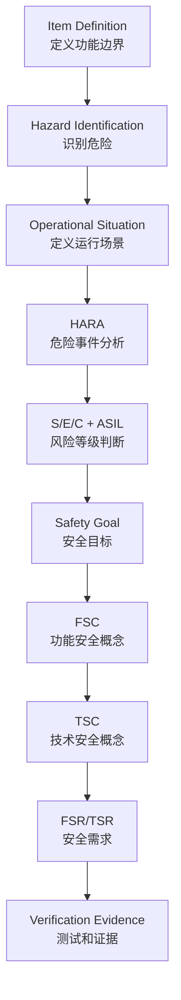
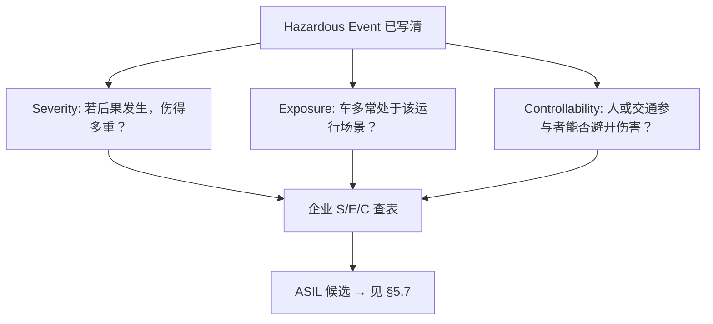

# 2026年6月AEB功能安全基础执行包

## 1. 本月定位

本文件是 `12-2026年度双轨学习与能力建设计划书.md` 中“2026年6月计划”的具体实现。

6月主题：

**AEB功能安全基础：HARA、Safety Goal、FSC/TSC。**

本月目标不是泛泛了解 `ISO 26262`，而是围绕一个具体功能 `AEB`，把功能安全概念阶段的核心逻辑打通：

> 功能定义 -> 危险识别 -> 场景分析 -> ASIL判断 -> Safety Goal -> FSC -> TSC -> 需求追踪。

本月结束后，应能回答：

- AEB是什么功能，边界是什么？
- AEB有哪些危险事件？
- 为什么AEB漏触发和误触发都可能是安全问题？
- HARA到底怎么做？
- S/E/C分别怎么理解？**如何判断**（见 **§5.6**）？
- ASIL为什么不能脱离场景固定判断？
- Safety Goal怎么从危险事件推导出来？
- FSC和TSC有什么区别？
- FSR和TSR如何分解？
- 如何把Safety Goal追踪到测试证据？

## 2. 本月交付物清单

| 编号 | 交付物 | 目标 |
| --- | --- | --- |
| M06-01 | AEB Item Definition | 明确分析边界 |
| M06-02 | AEB Hazard List | 识别危险来源 |
| M06-03 | AEB HARA V1 | 完成危险事件、S/E/C、ASIL候选和Safety Goal |
| M06-04 | AEB Safety Goals V1 | 从HARA推导安全目标 |
| M06-05 | AEB FSC V1 | 将Safety Goal转为功能安全需求 |
| M06-06 | AEB TSC V1 | 将功能需求落到技术安全机制 |
| M06-07 | SG-FSR-TSR追踪表 | 建立需求追踪链 |
| M06-08 | 6月验收问答 | 检查是否真正理解 |

## 3. 本月学习总图

功能安全分析可以理解为一个逐层收敛过程：



一句话理解：

> HARA告诉你“什么场景下会有什么危险、严重到什么程度”；Safety Goal告诉你“系统必须避免什么”；FSC/TSC告诉你“系统怎么避免”；测试证据告诉你“怎么证明真的避免了”。

## 4. 功能安全基础概念

## 4.1 Item Definition

### 4.1.1 理论

`Item Definition` 是功能安全分析的入口。

它要回答：

- 分析对象是什么？
- 功能目标是什么？
- 系统边界在哪里？
- 输入是什么？
- 输出是什么？
- 与哪些外部系统交互？
- 驾驶员责任是什么？
- ODD或使用条件是什么？
- 不分析什么？

如果Item Definition不清楚，后面的HARA会失控。

例如，AEB可以有不同边界：

- 只分析纵向紧急制动功能。
- 分析AEB作为L2辅助驾驶功能的一部分。
- 分析AEB作为L3 ADS最小风险策略的一部分。
- 分析AEB与ACC、FCW、ESC、HMI的交互。

边界不同，HARA、ASIL、Safety Goal和安全机制都会不同。

### 4.1.2 AEB Item Definition示例

| 项目 | 内容 |
| --- | --- |
| 功能名称 | AEB，Automatic Emergency Braking，自动紧急制动 |
| 功能目标 | 当前方车辆、行人、两轮车或障碍物存在碰撞风险且驾驶员未及时响应时，系统自动预警或制动，降低碰撞概率或减轻碰撞严重度 |
| 自动化等级 | 主要作为L1/L2辅助驾驶功能，也可作为更高阶ADS纵向安全子功能 |
| 主要输入 | 摄像头、毫米波雷达、激光雷达如有、车速、横摆率、方向盘角、制动踏板、油门踏板、目标距离、相对速度、目标类别、置信度 |
| 主要输出 | 预警请求、制动请求、目标减速度、功能状态、故障状态、HMI提示、事件记录 |
| 执行对象 | ESC/ESP、制动系统、VCU/底盘域控、HMI、诊断记录模块 |
| 驾驶员责任 | L1/L2场景下驾驶员持续监控环境并对驾驶负责 |
| 初始ODD | 城市道路、高速道路、10-120 km/h、晴天/小雨/夜间等需进一步定义 |
| 不覆盖范围 | 不覆盖完整自动驾驶决策，不覆盖转向避让策略，不覆盖所有NOA系统行为 |
| 安全状态 | 错误制动请求被抑制或限制；关键故障时AEB降级/退出并提示驾驶员；基础制动仍可用 |

### 4.1.3 实践任务

请补充你自己的AEB Item Definition：

| 项目 | 你的填写 |
| --- | --- |
| 功能边界 |  |
| 目标物类型 |  |
| 车速范围 |  |
| 道路范围 |  |
| 传感器配置 |  |
| 输出接口 |  |
| 驾驶员责任 |  |
| 不覆盖内容 |  |

验收标准：

> 能清楚说明“我分析的是哪个AEB，不分析哪些内容”。

## 4.2 Hazard

### 4.2.1 理论

`Hazard` 是可能导致伤害的潜在来源。

在功能安全中，不能只写“系统故障”，要写这个故障可能造成的车辆危险行为。

错误写法：

- 感知模块故障。
- 雷达信号异常。
- 软件bug。
- 模型漏检。

更好的写法：

- AEB未在碰撞风险存在时触发制动。
- AEB在无碰撞风险时发出强制动请求。
- AEB发出过大的减速度请求。
- AEB关键传感器不可用但系统未降级。

区别是：

> Hazard要面向车辆级危险行为，而不是停留在模块故障。

### 4.2.2 AEB主要Hazard清单

| Hazard ID | Hazard | 说明 |
| --- | --- | --- |
| H-AEB-001 | 前方真实碰撞风险存在，AEB未触发或触发过晚 | 对应漏触发，可能导致追尾或撞人 |
| H-AEB-002 | 无真实碰撞风险，AEB误触发强制动 | 对应误触发，可能导致后车追尾或乘员伤害 |
| H-AEB-003 | AEB制动请求减速度过大或持续过长 | 可能导致车辆失稳、后车追尾或乘员不适 |
| H-AEB-004 | 关键传感器故障或退化未被识别，AEB继续输出可信判断 | 可能导致漏触发、误触发或错误风险评估 |
| H-AEB-005 | AEB不可用或退出时未提示驾驶员 | 驾驶员误信任系统，未及时接管 |
| H-AEB-006 | AEB制动请求未被执行或执行延迟 | 碰撞风险未被有效降低 |

### 4.2.3 实践任务

补充至少3个AEB Hazard：

| Hazard ID | Hazard | 可能后果 |
| --- | --- | --- |
| H-AEB-007 |  |  |
| H-AEB-008 |  |  |
| H-AEB-009 |  |  |

验收标准：

> 写出来的Hazard必须是车辆级危险行为，而不是模块级故障。

## 4.3 Operational Situation

### 4.3.1 理论

`Operational Situation` 是危险发生时的运行场景。

同一个Hazard，在不同Operational Situation下，风险等级可能不同。

例如：

危险：AEB误触发强制动。

不同场景：

- 高速巡航，后车距离很近。
- 城市低速拥堵。
- 地库低速行驶。

这三个场景的严重度、暴露率、可控性都不同，因此ASIL可能不同。

### 4.3.2 AEB典型Operational Situation

| Situation ID | Operational Situation | 关注点 |
| --- | --- | --- |
| OS-AEB-001 | 高速道路，100 km/h跟车，前车急刹 | 漏触发可能导致高速追尾 |
| OS-AEB-002 | 城市道路，40 km/h，行人横穿 | 漏触发可能导致行人伤害 |
| OS-AEB-003 | 高速巡航，后车跟车距离近，无真实障碍物 | 误制动可能导致后车追尾 |
| OS-AEB-004 | 雨雾天气，传感器部分污染 | 功能不足或传感器退化风险 |
| OS-AEB-005 | 夜间逆光或隧道出口 | 感知性能下降 |
| OS-AEB-006 | 低速拥堵，车辆频繁起停 | 误触发可能引起轻微碰撞或体验问题 |

### 4.3.3 实践任务

对每个Hazard至少配置2个Operational Situation：

| Hazard | Operational Situation 1 | Operational Situation 2 |
| --- | --- | --- |
| AEB未触发或触发过晚 |  |  |
| AEB误触发强制动 |  |  |
| AEB制动请求过大 |  |  |

验收标准：

> 能说明为什么同一个Hazard在不同场景下ASIL可能不同。

## 4.4 Hazardous Event

### 4.4.1 理论

`Hazardous Event` = Hazard + Operational Situation。

也就是：

> 危险行为发生在具体运行场景中，才形成可评估的危险事件。

示例：

- Hazard：AEB未触发或触发过晚。
- Operational Situation：高速跟车，前车急刹。
- Hazardous Event：高速跟车前车急刹时，AEB未触发或触发过晚，导致追尾风险。

### 4.4.2 AEB Hazardous Event示例

| HE ID | Hazardous Event |
| --- | --- |
| HE-AEB-001 | 高速跟车前车急刹时，AEB未触发或触发过晚 |
| HE-AEB-002 | 城市道路行人横穿时，AEB未触发或触发过晚 |
| HE-AEB-003 | 高速巡航且后车距离较近时，AEB在无碰撞风险下误触发强制动 |
| HE-AEB-004 | 雨雾或传感器污染场景下，AEB未识别传感器退化并继续输出可信判断 |
| HE-AEB-005 | AEB不可用时未提示驾驶员，驾驶员误以为功能可用 |

### 4.4.3 实践任务

写出5个AEB Hazardous Event：

| HE ID | Hazard | Operational Situation | Hazardous Event |
| --- | --- | --- | --- |
| HE-AEB-X01 |  |  |  |
| HE-AEB-X02 |  |  |  |
| HE-AEB-X03 |  |  |  |
| HE-AEB-X04 |  |  |  |
| HE-AEB-X05 |  |  |  |

验收标准：

> 每个Hazardous Event都必须包含“危险行为 + 场景”。

## 5. HARA怎么做

## 5.1 HARA是什么

`HARA` 是 Hazard Analysis and Risk Assessment，危险分析与风险评估。

它的目标是：

- 找出功能可能导致的不合理风险。
- 结合运行场景评估风险等级。
- 推导Safety Goal。
- 为后续FSC/TSC提供输入。

HARA不是为了填表，而是为了回答：

> 这个功能在什么场景下可能伤人？严重程度如何？出现概率如何？驾驶员能不能控制？系统必须避免什么？

## 5.2 HARA核心字段

| 字段 | 含义 |
| --- | --- |
| Hazard ID | 危险编号 |
| Hazard | 车辆级危险行为 |
| Operational Situation | 运行场景 |
| Hazardous Event | 危险事件 |
| Severity | 严重度 |
| Exposure | 暴露率 |
| Controllability | 可控性 |
| ASIL | 汽车安全完整性等级 |
| Safety Goal | 安全目标 |

## 5.3 Severity怎么理解

`Severity` 表示可能伤害的严重程度。

常见理解：

| 等级 | 含义 | AEB例子 |
| --- | --- | --- |
| S0 | 无伤害 | 仅轻微体验问题 |
| S1 | 轻微或中等伤害 | 低速轻微碰撞、乘员轻微不适 |
| S2 | 严重但通常可存活伤害 | 中速碰撞、行人受伤 |
| S3 | 致命或危及生命伤害 | 高速追尾、撞行人、撞两轮车 |

注意：

Severity关注伤害后果，不关注发生概率。

### AEB Severity示例

| 场景 | 可能Severity | 理由 |
| --- | --- | --- |
| 高速跟车前车急刹，AEB漏触发 | S3候选 | 高速追尾可能导致严重或致命伤害 |
| 城市40 km/h行人横穿，AEB漏触发 | S2/S3候选 | 行人伤害严重，具体取决于速度和碰撞形态 |
| 低速拥堵AEB误触发 | S1/S2候选 | 通常速度低，但仍可能导致轻微碰撞或乘员不适 |
| 高速无障碍物AEB强制动，后车很近 | S2/S3候选 | 可能导致后车追尾 |

## 5.4 Exposure怎么理解

`Exposure` 表示车辆处于该运行场景的频率。

常见理解：

| 等级 | 含义 | 例子 |
| --- | --- | --- |
| E0 | 几乎不可能 | 极端罕见场景 |
| E1 | 很低概率 | 特殊道路或特殊天气 |
| E2 | 低概率 | 偶发场景 |
| E3 | 中等概率 | 日常可能遇到 |
| E4 | 高概率 | 经常遇到 |

Exposure不是危险发生概率，而是运行场景出现概率。

例如：

- 高速跟车是常见场景，Exposure可能较高。
- 极端暴雪可能Exposure较低。
- 城市行人横穿在城市道路较常见。

### AEB Exposure示例

| 场景 | 可能Exposure | 理由 |
| --- | --- | --- |
| 高速跟车 | E4候选 | 高速驾驶中常见 |
| 城市行人横穿 | E3/E4候选 | 城市道路常见 |
| 严重暴雪 | E1/E2候选 | 与地区和ODD有关 |
| 地库低速行驶 | E2/E3候选 | 取决于功能是否在地库可用 |

## 5.5 Controllability怎么理解

`Controllability` 表示驾驶员或其他交通参与者避免伤害的能力。

常见理解：

| 等级 | 含义 | AEB例子 |
| --- | --- | --- |
| C0 | 可完全控制 | 几乎无风险 |
| C1 | 一般驾驶员容易控制 | 低速、反应时间充足 |
| C2 | 部分驾驶员可控制 | 情况突然，但仍可能通过制动/转向避免 |
| C3 | 很难或不可控制 | 高速、突然、反应时间极短 |

Controllability非常依赖场景：

- 高速前车急刹，驾驶员可控性较差。
- 低速拥堵，驾驶员较容易控制。
- 行人突然横穿，行人和驾驶员可控性都可能低。

### AEB Controllability示例

| 场景 | 可能Controllability | 理由 |
| --- | --- | --- |
| 高速前车急刹AEB漏触发 | C2/C3候选 | 驾驶员反应时间有限 |
| 城市行人突然横穿AEB漏触发 | C2/C3候选 | 目标突然出现，可控性较低 |
| 低速误制动 | C1/C2候选 | 后车和驾驶员通常有一定反应空间 |
| 高速误制动且后车近 | C2/C3候选 | 后车驾驶员可控性较差 |

## 5.6 S/E/C如何判断（详细方法）

§5.3～§5.5 说明了 S/E/C **是什么**；本节说明在 HARA 表里 **怎么判、按什么顺序判、理由怎么写**。学习作品与项目初稿中，建议一律写 **「Sx / Ex / Cx 候选」**，最终等级由企业 HARA 方法、查表规则和评审确认。

### 5.6.1 前提：先固定「评什么」

S/E/C **不是**对「摄像头坏了」「模型漏检」打分，而是对已经写清的一行 **Hazardous Event（危险事件）** 打分：

> **Hazard**（车辆级危险行为） + **Operational Situation**（运行场景） = **Hazardous Event**

例如：

> 高速跟车、前车急刹时，**AEB 未触发或触发过晚**。

判分前必须确认三件事：

| 检查项 | 说明 |
| --- | --- |
| 危险事件是否可想象 | 能描述「若发生，最坏合理后果是什么」 |
| 运行场景是否具体 | 有速度、道路类型、目标类型、天气/光照等，不能写「各种情况」 |
| 三维是否分开 | S 只看伤害；E 只看场景出现频率；C 只看人机能否避险——**不要混在一个理由里** |



### 5.6.2 Severity（S）怎么判

**定义（判分时心里默念）**：假设该危险事件**已经导致最合理的伤害后果**（通常是碰撞或等同险情），可能造成的**人身伤害有多严重**。

**不评什么**：

- 不评 AEB 失效概率（那是风险组合里别的工作，不是 S）。
- 不评「场景常不常见」（那是 E）。
- 不把「漏检/FN」本身当 S——S 评的是 **撞了之后人多伤**。

**推荐五步**：

| 步骤 | 做什么 | AEB 示例（高速跟车漏触发） |
| --- | --- | --- |
| 1 | 写出**最合理**的实体后果 | 自车高速追尾前车，或严重减速导致连环事故 |
| 2 | 列出**可能受伤对象** | 本车乘员、前车乘员；若涉及行人/两轮车一并列出 |
| 3 | 用**相对速度、碰撞类型、目标类型**粗估伤害等级 | 100 km/h 级追尾 → 通常高于 40 km/h 城市碰行人 |
| 4 | 对照企业/ISO 26262-3 的 **S0～S3** 定义选级 | 高速追尾 → **S3 候选** |
| 5 | **理由只写伤害链**，不写技术根因 | 「高速追尾可导致致命或危及生命伤害」✓；「因 YOLO 漏检」✗ |

**S0～S3 决策问题（答完再选级）**：

1. 若后果发生，是否**基本不会有人身伤害**？→ 倾向 S0  
2. 是否多为**轻伤、中等伤**或仅不适？→ 倾向 S1  
3. 是否可能出现**重伤但多数可存活**（中高速碰撞、行人受伤等）？→ 倾向 S2  
4. 是否可能出现**死亡或危及生命**（高速追尾、高速撞行人/两轮车等）？→ 倾向 S3  

**AEB 常见场景的 S 候选（与 §5.3 表一致，便于对照）**：

| Hazardous Event（摘要） | S 候选 | 理由要点（安全评审口吻） |
| --- | --- | --- |
| 高速跟车，AEB 漏触发 | S3 | 高速追尾，乘员/对方车辆重伤或致命风险高 |
| 城市 40 km/h 行人横穿，AEB 漏触发 | S2/S3 | 行人无防护；速度越高越倾向 S3 |
| 低速拥堵，AEB 误触发 | S1/S2 | 相对速度低，多为轻微碰撞或不适 |
| 高速无风险误强制动、后车很近 | S2/S3 | 后车高速追尾风险 |

### 5.6.3 Exposure（E）怎么判

**定义**：车辆在 **Operational Situation（运行场景）** 下行驶或暴露其中的**频率**——即「车有多常处于这种驾驶环境」，**不是**「这种危险一年发生几次」。

**推荐四步**：

| 步骤 | 做什么 | 注意 |
| --- | --- | --- |
| 1 | 从危险事件中**抽出运行场景**（去掉 AEB 失效描述） | 「高速跟车、前车急刹」→ 场景核心是 **高速跟车** |
| 2 | 对照 **ODD、目标市场、典型用法** | 高速跟车在中国高速 ODD 内 → 常出现 |
| 3 | 选 **E0～E4**（以企业定义为准） | 学习阶段可用 §5.4 表 |
| 4 | 理由写**场景频率依据** | 「高速跟车为常见驾驶场景」✓；「AEB 失效很少」✗ |

**E0～E4 决策问题**：

1. 该场景在 ODD 内是否**几乎从不**出现？→ E0/E1  
2. 是否**偶发**（特殊天气、罕见道路）？→ E1/E2  
3. 是否**日常会遇到**（城市路口、一般跟车）？→ E3  
4. 是否**高频**（高速巡航、城市通勤主场景）？→ E4  

**易混对比**：

| 错误理解 | 正确理解 |
| --- | --- |
| 「AEB 漏检概率 0.1%」→ E1 | E 评的是 **车是否在高速跟车场景里开**，不是失效率 |
| 「行人横穿很危险」→ E 高 | 危险≠暴露；要问 **该 ODD 下横穿场景多不多** |
| 把 FN 次数当 E | FN 属于失效/性能证据，填在验证或危害分析别处，不替代 E |

### 5.6.4 Controllability（C）怎么判

**定义**：在危险事件相关的时刻，**驾驶员或其他交通参与者**（后车驾驶员、行人等）通过转向、制动、避让等手段**避免或减轻伤害**的可能性。

**推荐五步**：

| 步骤 | 做什么 |
| --- | --- |
| 1 | 明确**评谁**：本车驾驶员 / 后车驾驶员 / 行人（可能多人） |
| 2 | 估 **可用反应时间**（TTC、是否突然出现、是否分心） |
| 3 | 估 **可执行操作**（制动距离、转向空间、是否被遮挡） |
| 4 | 选 **C0～C3**（以企业定义为准） |
| 5 | 理由写**人与环境**，不写算法 |

**C0～C3 决策问题**：

1. 一般驾驶员是否**很容易**避免伤害？→ C0/C1  
2. 情况突然，但**部分**熟练驾驶员仍可能避免？→ C2  
3. 高速、短 TTC、目标突然出现，**多数情况下难以**避免？→ C2/C3  
4. 驾驶员**不知道**系统已不可靠（如传感器退化未提示）？→ 常倾向更低可控性  

**FN 与 FP 时 C 的评法差异（AEB）**：

| 类型 | 常评谁 | 典型判断 |
| --- | --- | --- |
| **漏触发（FN）** | 本车驾驶员能否在碰撞前制动/避让 | 前车急刹、行人突然出现 → C2/C3 候选 |
| **误触发（FP）** | 本车乘员冲击 + **后车**能否避免追尾 | 高速、后车近 → 后车 C2/C3 候选 |
| **仅 HMI/舒适问题** | 驾驶员 | 可能 C0/C1，但 S 也通常较低 |

### 5.6.5 三个维度判完后：如何得到 ASIL

1. 对**同一行**危险事件，分别得到 S、E、C（可带候选范围，如 S2/S3）。  
2. 用企业认可的 **S/E/C → ASIL 查表**（ISO 26262-3 附录思路）得到 **ASIL 候选**。  
3. 若 S、E、C 有一个标了范围，ASIL 也标范围（如 ASIL B/C 候选），并在评审中说明敏感维度。  

详见 **§5.7**；**禁止**跳过 S/E/C 直接写「AEB = ASIL D」。

### 5.6.6 完整走查示例：HE-AEB-001

**危险事件**：高速跟车前车急刹时，AEB 未触发或触发过晚。

| 维度 | 候选 | 判断过程（可写入 HARA「理由」列） |
| --- | --- | --- |
| **S** | S3 | 最合理后果为高速追尾；相对速度高，乘员重伤或死亡风险 → 对应 S3 |
| **E** | E4 | 运行场景为「高速跟车」；在声明 ODD 的高速公路上属高频场景 → E4 |
| **C** | C2/C3 | 前车急刹时 TTC 短，一般驾驶员制动/避让窗口有限 → C2/C3 |
| **ASIL** | ASIL C/D 候选 | 由企业表查得；学习阶段不写死 |

与 §6.1 示例表一致；§6.2、§6.3 可用同一五步分别走一遍。

### 5.6.7 理由怎么写（模板）

每个维度用 **「场景事实 + 推断 + 等级」** 一句，避免空话：

| 维度 | 推荐句式 | 反例（模糊） |
| --- | --- | --- |
| S | 「若发生 [后果]，[对象] 可能 [伤型]，故 Sx 候选」 | 「后果很严重」 |
| E | 「在 [ODD] 下，[运行场景] [经常/偶尔] 出现，故 Ex 候选」 | 「挺常见的」 |
| C | 「[谁] 在 [TTC/突发] 下 [难/可] 制动或避让，故 Cx 候选」 | 「驾驶员来不及」 |

**示例（HE-AEB-002 城市行人横穿漏触发）**：

- **S**：「若碰撞行人，行人无防护且城市 40 km/h 下重伤风险高，故 S2/S3 候选。」  
- **E**：「城市道路的行人横穿/近距行人在 ODD 内较常见，故 E3/E4 候选。」  
- **C**：「行人突然出现、驾驶员反应窗口短，故 C2/C3 候选。」  

### 5.6.8 常见判断错误

| 错误 | 正确做法 |
| --- | --- |
| 用「模型精度低」当 S | S 只写**人身伤害后果** |
| 用「失效很少」当 E | E 只写**运行场景出现频率** |
| 不区分驾驶员与后车驾驶员 | FP/追尾类必须写清**评谁** |
| 三个维度理由混在一段 | S/E/C **各写一行理由** |
| 未写 Hazardous Event 就打分 | 先补全 HE 再判 S/E/C |
| 学习阶段写死 ASIL D | 写 **ASIL 候选** + 范围 |

### 5.6.9 自测：你是否会判 S/E/C

给定一行 Hazardous Event，能独立完成即达到 6 月 HARA 要求：

1. 拆出 **Operational Situation** 与 **Hazard**。  
2. 分别给出 S、E、C **候选等级 + 各一句理由**。  
3. 指出**哪一维最敏感**（改它会明显改变 ASIL）。  
4. 写出 **ASIL 候选**（不写死）和一句 **Safety Goal 草案**。  

动手模板见 **§11.3**；理论走查见 **§6.1～§6.3**。

## 5.7 ASIL怎么理解

`ASIL` 是 Automotive Safety Integrity Level，汽车安全完整性等级。

从低到高：

- QM。
- ASIL A。
- ASIL B。
- ASIL C。
- ASIL D。

ASIL不是凭感觉定的，而是由：

> Severity + Exposure + Controllability

共同决定。

注意：

- ASIL需要结合企业方法、车型、目标市场、ODD和评审规则最终确认。
- 学习作品集中可以写“ASIL候选”，不要绝对声称固定结论。
- 同一个功能不同危险事件可能有不同ASIL。
- 同一个危险事件在不同Operational Situation下ASIL也可能不同。

## 6. AEB HARA V1示例

以下表格用于学习和作品集初版，不代表真实项目最终ASIL。

| HE ID | Hazardous Event | S | E | C | ASIL候选 | Safety Goal草案 |
| --- | --- | --- | --- | --- | --- | --- |
| HE-AEB-001 | 高速跟车前车急刹时，AEB未触发或触发过晚 | S3 | E4 | C2/C3 | ASIL C/D候选 | AEB应在ODD内识别高碰撞风险并及时触发预警或制动 |
| HE-AEB-002 | 城市道路行人横穿时，AEB未触发或触发过晚 | S2/S3 | E3/E4 | C2/C3 | ASIL B/C/D候选 | AEB应在行人碰撞风险超过阈值时及时预警或制动 |
| HE-AEB-003 | 高速巡航且后车距离较近时，AEB在无碰撞风险下误触发强制动 | S2/S3 | E3/E4 | C2 | ASIL B/C候选 | AEB不应在无合理碰撞风险时发出强制动请求 |
| HE-AEB-004 | AEB制动请求减速度过大或持续过长 | S2 | E3/E4 | C1/C2 | ASIL A/B候选 | AEB制动请求应被限制在车辆稳定性和乘员安全范围内 |
| HE-AEB-005 | 传感器污染或退化未被识别，AEB继续输出可信判断 | S2/S3 | E2/E3 | C2 | ASIL B/C候选 | 当关键传感器不满足安全运行条件时，AEB应降级、退出或提示 |
| HE-AEB-006 | AEB不可用但未提示驾驶员 | S1/S2 | E3 | C2 | ASIL A/B候选 | AEB不可用、降级或退出时应及时向驾驶员提示 |

## 6.1 示例1：高速跟车AEB漏触发

### 场景描述

自车在高速道路以100 km/h跟随前车行驶，前车突然急刹。AEB因目标检测漏检、TTC估计错误或风险判断延迟，未及时触发预警或制动。

### 风险分析

- Hazard：AEB未触发或触发过晚。
- Operational Situation：高速跟车，前车急刹。
- Hazardous Event：高速跟车前车急刹时，AEB未触发或触发过晚。
- 可能后果：高速追尾，乘员严重伤害。

### S/E/C判断

判分步骤见 **§5.6**；本例结论如下。

| 维度 | 判断 | 理由 |
| --- | --- | --- |
| S | S3候选 | 高速追尾可能导致严重或致命伤害 |
| E | E4候选 | 高速跟车是常见驾驶场景 |
| C | C2/C3候选 | 前车急刹时驾驶员反应时间有限 |

### Safety Goal草案

> AEB应在ODD内当前方目标存在高碰撞风险时，在规定时间内触发预警或制动，以降低碰撞概率或减轻碰撞严重度。

### 后续需求方向

- 感知目标检测应覆盖前车急刹场景。
- TTC计算应满足时间准确性要求。
- AEB风险判断应在规定时间内完成。
- 制动请求应及时传递到底盘执行系统。
- 关键输入异常时应降级或提示。

## 6.2 示例2：高速AEB误触发强制动

### 场景描述

自车在高速道路正常巡航，前方无真实碰撞风险。由于路面阴影、金属反光、目标误检或融合错误，AEB错误发出强制动请求。

### 风险分析

- Hazard：AEB误触发强制动。
- Operational Situation：高速巡航，后车距离较近。
- Hazardous Event：无真实碰撞风险时AEB误触发强制动。
- 可能后果：后车追尾，乘员受伤，交通扰动。

### S/E/C判断

判分步骤见 **§5.6**；本例结论如下。

| 维度 | 判断 | 理由 |
| --- | --- | --- |
| S | S2/S3候选 | 后车追尾可能造成严重伤害 |
| E | E3/E4候选 | 高速巡航常见，后车跟随也常见 |
| C | C2候选 | 后车驾驶员可能有一定反应空间，但高速下控制难度较高 |

### Safety Goal草案

> AEB不应在无合理碰撞风险时发出导致车辆显著减速的强制动请求。

### 后续需求方向

- AEB制动请求应经过独立合理性检查。
- 应检查目标持续性、TTC范围、目标类别、置信度。
- 应进行多传感器一致性检查。
- 应限制最大减速度、jerk和制动持续时间。
- 对误检高发场景应建立回归测试集。

## 6.3 示例3：传感器污染未识别

### 场景描述

雨雾、泥污、雪、水滴等导致摄像头或雷达性能下降，但系统未识别传感器不可用或性能退化，AEB继续输出可信判断。

### 风险分析

- Hazard：关键传感器退化未被识别。
- Operational Situation：雨雾或传感器污染场景。
- Hazardous Event：传感器退化但AEB继续输出可信判断。
- 可能后果：漏触发、误触发或错误风险评估。

### S/E/C判断

判分步骤见 **§5.6**；本例结论如下。

| 维度 | 判断 | 理由 |
| --- | --- | --- |
| S | S2/S3候选 | 取决于车速和目标类型，可能导致严重碰撞 |
| E | E2/E3候选 | 雨雾和污染场景与地区、天气、季节有关 |
| C | C2候选 | 驾驶员可能不知道AEB能力下降，控制难度增加 |

### Safety Goal草案

> 当AEB关键传感器、感知链路或制动执行链路不满足安全运行条件时，系统应进入降级、退出或驾驶员提示状态。

## 7. Safety Goal怎么推导

## 7.1 理论

Safety Goal是从HARA中高风险危险事件推导出的顶层安全目标。

Safety Goal要表达：

> 系统必须避免什么不合理风险。

不要把Safety Goal写得太细。

错误写法：

- 摄像头应以30fps输出图像。
- TTC阈值应设置为1.5秒。
- CAN信号超时时间应为100ms。

这些是技术需求，不是Safety Goal。

更好的写法：

- AEB应在ODD内碰撞风险超过阈值时及时触发预警或制动。
- AEB不应在无合理碰撞风险时发出强制动请求。
- AEB制动请求应被限制在车辆稳定性和乘员安全范围内。
- AEB不可用、降级或退出时应及时提示驾驶员。

## 7.2 AEB Safety Goals V1

| SG ID | Safety Goal | 来源 |
| --- | --- | --- |
| SG-AEB-001 | AEB应在ODD内当前方目标存在高碰撞风险时，在规定时间内触发预警或制动 | HE-AEB-001、HE-AEB-002 |
| SG-AEB-002 | AEB不应在无合理碰撞风险时发出导致车辆显著减速的强制动请求 | HE-AEB-003 |
| SG-AEB-003 | AEB制动请求应受到减速度、jerk、持续时间和车辆稳定性约束 | HE-AEB-004 |
| SG-AEB-004 | 当关键传感器、感知链路或制动执行链路不满足安全运行条件时，AEB应降级、退出或提示驾驶员 | HE-AEB-005 |
| SG-AEB-005 | AEB不可用、降级或退出时，应向驾驶员发出及时且可理解的提示 | HE-AEB-006 |

## 7.3 Safety Goal检查标准

一个好的Safety Goal应满足：

- 来源于HARA。
- 描述车辆级安全目标。
- 不过早指定具体技术实现。
- 能被进一步分解为FSR。
- 能通过验证证据证明。

## 8. FSC功能安全概念

## 8.1 FSC是什么

`FSC` 是 Functional Safety Concept，功能安全概念。

它回答：

> 为了实现Safety Goal，系统在功能层面应该具备哪些安全能力？

FSC通常输出：

- Functional Safety Requirement，FSR。
- 安全状态。
- 功能降级策略。
- 初步安全机制。
- 功能分配对象。

FSC仍然偏功能层，不应该过早写具体代码、通信周期、芯片配置。

## 8.2 AEB FSC V1

| FSR ID | Functional Safety Requirement | 对应SG | 分配对象 |
| --- | --- | --- | --- |
| FSR-AEB-001 | AEB应基于目标距离、相对速度、目标类型、TTC和置信度评估碰撞风险 | SG-AEB-001 | AEB功能模块 |
| FSR-AEB-002 | AEB应在碰撞风险超过阈值且驾驶员未有效响应时触发预警或制动请求 | SG-AEB-001 | AEB决策模块 |
| FSR-AEB-003 | AEB制动请求应经过独立合理性检查，避免单点错误导致误制动 | SG-AEB-002 | AEB监控模块 |
| FSR-AEB-004 | AEB制动请求应限制最大减速度、jerk和持续时间 | SG-AEB-003 | 制动请求管理模块 |
| FSR-AEB-005 | AEB应监控关键传感器状态、输入有效性、时间戳和信号一致性 | SG-AEB-004 | 感知/融合/诊断模块 |
| FSR-AEB-006 | 当AEB不可用、降级或退出时，应向驾驶员发出提示 | SG-AEB-005 | HMI模块 |
| FSR-AEB-007 | AEB应记录触发、抑制、故障、降级和驾驶员接管事件 | SG-AEB-001~005 | 诊断/数据记录模块 |

## 8.3 FSC示例解释

以 `SG-AEB-002` 为例：

Safety Goal：

> AEB不应在无合理碰撞风险时发出导致车辆显著减速的强制动请求。

对应FSR：

> AEB制动请求应经过独立合理性检查，避免单点错误导致误制动。

为什么合理：

- 误制动可能来自感知误检、TTC错误、软件逻辑错误。
- 独立合理性检查可以作为安全机制，阻止明显不合理的制动请求。
- 后续TSC可以进一步定义检查内容，如目标有效性、车速范围、TTC范围、目标持续性、多传感器一致性。

## 9. TSC技术安全概念

## 9.1 TSC是什么

`TSC` 是 Technical Safety Concept，技术安全概念。

它回答：

> 功能层安全需求如何落到系统架构、技术机制和接口要求上？

TSC比FSC更具体。

它会涉及：

- 传感器输入检查。
- 时间同步。
- 信号有效性。
- 目标一致性。
- TTC合理性。
- 制动请求限幅。
- 通信超时。
- E2E保护。
- 诊断。
- 降级。
- HMI提示。

## 9.2 AEB TSC V1

| TSR ID | Technical Safety Requirement | 对应FSR | 安全机制 |
| --- | --- | --- | --- |
| TSR-AEB-001 | AEB输入信号应检查时间戳、有效位、更新周期和范围 | FSR-AEB-005 | Input Validity Check |
| TSR-AEB-002 | 摄像头、雷达等关键目标输入应进行目标一致性和持续性检查 | FSR-AEB-001、005 | Sensor Fusion Consistency |
| TSR-AEB-003 | TTC计算结果应进行范围检查和跳变检查 | FSR-AEB-001 | TTC Plausibility Check |
| TSR-AEB-004 | AEB制动请求应由独立监控器检查目标有效性、车速范围、TTC范围和驾驶员输入 | FSR-AEB-003 | Independent Monitor |
| TSR-AEB-005 | 制动请求应限制最大减速度、jerk和持续时间 | FSR-AEB-004 | Actuation Limiter |
| TSR-AEB-006 | AEB与制动系统通信应具备超时检测和错误处理 | FSR-AEB-002、004 | Communication Timeout |
| TSR-AEB-007 | 关键故障应触发DTC、HMI提示和功能降级 | FSR-AEB-005、006 | Diagnostics and Degradation |
| TSR-AEB-008 | AEB触发、抑制、故障和驾驶员接管事件应记录时间、版本、输入和输出状态 | FSR-AEB-007 | Event Logging |

## 9.3 TSC示例解释

以 `TSR-AEB-004` 为例：

技术需求：

> AEB制动请求应由独立监控器检查目标有效性、车速范围、TTC范围和驾驶员输入。

它解决的问题：

- 感知误检导致虚假目标。
- TTC计算错误导致误制动。
- 软件逻辑错误导致错误制动请求。
- 驾驶员已经踩油门或转向避让时系统仍强制动。

监控器可以检查：

- 目标是否持续存在。
- 目标是否位于自车路径相关区域。
- TTC是否在合理范围。
- 车速是否在AEB工作范围。
- 驾驶员是否已有明确接管输入。
- 制动请求是否超过限制。

## 10. SG-FSR-TSR追踪表

| SG | FSR | TSR | 验证方法 | 证据 |
| --- | --- | --- | --- | --- |
| SG-AEB-001 | FSR-AEB-001 | TSR-AEB-001/002/003 | SIL仿真、场景回放、实车测试 | 输入有效性测试、TTC验证报告 |
| SG-AEB-001 | FSR-AEB-002 | TSR-AEB-004 | SIL/HIL、封闭场测试 | AEB触发时刻和制动请求记录 |
| SG-AEB-002 | FSR-AEB-003 | TSR-AEB-004 | 误触发场景测试、故障注入 | False Brake Rate报告、监控器测试 |
| SG-AEB-003 | FSR-AEB-004 | TSR-AEB-005 | 制动边界测试、HIL | 最大减速度、jerk、持续时间测试 |
| SG-AEB-004 | FSR-AEB-005 | TSR-AEB-001/006/007 | 传感器遮挡、通信超时、故障注入 | DTC、降级状态、HMI提示记录 |
| SG-AEB-005 | FSR-AEB-006 | TSR-AEB-007 | HMI测试、故障注入 | HMI提示测试报告 |

追踪表的意义：

> 认证机构或面试官问“你如何证明这个Safety Goal被落实”，你可以从SG一路追踪到FSR、TSR、验证方法和证据。

## 10.1 代码视角：追踪矩阵完整性检查

6月的代码实践不需要复杂开发，只需要把追踪关系变成可检查规则。

目的：

> 防止Safety Goal、FSR、TSR、验证方法和证据之间出现断链。

建议用CSV或YAML维护追踪表，字段包括：

| 字段 | 含义 |
| --- | --- |
| sg_id | Safety Goal编号 |
| fsr_id | Functional Safety Requirement编号 |
| tsr_id | Technical Safety Requirement编号 |
| verification | 验证方法 |
| evidence | 证据文件或证据类型 |

检查规则：

- 每个 `SG` 至少关联一个 `FSR`。
- 每个 `FSR` 至少关联一个 `TSR`。
- 每个 `TSR` 必须有验证方法。
- 每个验证方法必须有证据类型。
- 不允许出现空字段。

伪代码示意：

```python
# 伪代码示意，后续可实现为 scripts/trace/traceability_check.py
for sg in safety_goals:
    assert has_related_fsr(sg)

for fsr in functional_safety_requirements:
    assert has_related_tsr(fsr)

for tsr in technical_safety_requirements:
    assert has_verification(tsr)
    assert has_evidence(tsr)
```

输出报告应包括：

- 缺少FSR的Safety Goal。
- 缺少TSR的FSR。
- 缺少验证方法的TSR。
- 缺少证据的验证项。
- 是否满足进入Safety Case的最低完整性。

## 11. 6月实践任务

## 11.1 实践任务1：完成AEB Item Definition

填写模板：

| 项目 | 内容 |
| --- | --- |
| 功能目标 |  |
| 输入 |  |
| 输出 |  |
| 执行对象 |  |
| 驾驶员责任 |  |
| ODD初始范围 |  |
| 不覆盖范围 |  |
| 安全状态 |  |

## 11.2 实践任务2：写出至少6个Hazardous Event

填写模板：

| HE ID | Hazard | Operational Situation | Hazardous Event |
| --- | --- | --- | --- |
| HE-AEB-X01 |  |  |  |
| HE-AEB-X02 |  |  |  |
| HE-AEB-X03 |  |  |  |
| HE-AEB-X04 |  |  |  |
| HE-AEB-X05 |  |  |  |
| HE-AEB-X06 |  |  |  |

## 11.3 实践任务3：完成HARA V1

S/E/C 判分方法见 **§5.6**（先写清 Hazardous Event，再分维打分、各写理由）。

填写模板：

| HE ID | Hazardous Event | S | S理由 | E | E理由 | C | C理由 | ASIL候选 | Safety Goal |
| --- | --- | --- | --- | --- | --- | --- | --- | --- | --- |
| HE-AEB-X01 |  |  |  |  |  |  |  |  |  |
| HE-AEB-X02 |  |  |  |  |  |  |  |  |  |
| HE-AEB-X03 |  |  |  |  |  |  |  |  |  |

要求：

- 每个S/E/C都必须写理由。
- ASIL写“候选”，不要写死。
- Safety Goal不要写成技术实现。

## 11.4 实践任务4：完成Safety Goals V1

填写模板：

| SG ID | Safety Goal | 来源HE | 说明 |
| --- | --- | --- | --- |
| SG-AEB-X01 |  |  |  |
| SG-AEB-X02 |  |  |  |
| SG-AEB-X03 |  |  |  |

## 11.5 实践任务5：完成FSC V1

填写模板：

| FSR ID | Functional Safety Requirement | 对应SG | 分配对象 |
| --- | --- | --- | --- |
| FSR-AEB-X01 |  |  |  |
| FSR-AEB-X02 |  |  |  |
| FSR-AEB-X03 |  |  |  |

## 11.6 实践任务6：完成TSC V1

填写模板：

| TSR ID | Technical Safety Requirement | 对应FSR | 安全机制 |
| --- | --- | --- | --- |
| TSR-AEB-X01 |  |  |  |
| TSR-AEB-X02 |  |  |  |
| TSR-AEB-X03 |  |  |  |

## 11.7 实践任务7：完成追踪表

填写模板：

| SG | FSR | TSR | Verification Method | Evidence |
| --- | --- | --- | --- | --- |
|  |  |  |  |  |
|  |  |  |  |  |
|  |  |  |  |  |

## 12. 常见错误

### 12.1 把故障当成Hazard

错误：

> 摄像头故障。

正确：

> 摄像头故障导致AEB未识别前方目标，系统未触发制动，产生碰撞风险。

### 12.2 脱离场景判断ASIL

错误：

> AEB一定是ASIL D。

正确：

> AEB不同危险事件、不同运行场景下ASIL不同，需要结合S/E/C判断。

### 12.3 Safety Goal写得太技术化

错误：

> 系统应在100ms内检测CAN信号超时。

正确：

> AEB关键输入或执行链路不满足安全运行条件时，系统应降级、退出或提示驾驶员。

### 12.4 FSC和TSC混淆

FSC偏功能安全能力：

> 系统应监控关键传感器状态。

TSC偏技术实现要求：

> 摄像头目标输入应检查时间戳、有效位、更新周期和信号冻结。

### 12.5 S/E/C理由写成技术故障或模糊话

错误：

> S：模型不好。E：偶尔。C：来不及。

正确：

> S：若高速追尾，乘员可能致命伤害，S3候选。E：高速跟车在 ODD 内高频，E4候选。C：前车急刹时 TTC 短，驾驶员难避让，C2/C3候选。（方法见 **§5.6**）

### 12.6 没有追踪关系

如果只有HARA、Safety Goal、FSR、TSR分散存在，但没有追踪表，就很难支撑认证和审计。

必须建立：

> HE -> SG -> FSR -> TSR -> Verification -> Evidence

## 13. 6月验收问答

### 13.1 AEB Item Definition为什么重要？

回答：

Item Definition定义分析对象和边界。如果不明确AEB的功能目标、输入输出、驾驶员责任、ODD和不覆盖范围，HARA会失控，ASIL判断和Safety Goal也会不稳定。

### 13.2 Hazard和Failure有什么区别？

回答：

Failure是系统、硬件、软件或模型层面的失效，例如摄像头信号异常、模型漏检。Hazard是车辆级危险行为，例如AEB未触发或误触发。功能安全分析最终关注的是Failure可能导致的车辆级Hazard。

### 13.3 Hazardous Event是什么？

回答：

Hazardous Event是Hazard和Operational Situation的组合。只有把危险行为放到具体运行场景中，才能评估Severity、Exposure和Controllability。

### 13.4 S/E/C分别怎么判断？

回答：

先固定一行 Hazardous Event，再分三维独立判断：S 评**若后果发生时的伤害严重程度**（不评失效率）；E 评**运行场景在 ODD 内出现频率**（不评 FN 次数）；C 评**驾驶员或其他交通参与者能否避险**（FN/FP 要分清评谁）。每维写一句「场景事实 + 推断 + 等级」理由，再查表得 ASIL 候选。详见 **§5.6**。

### 13.5 ASIL为什么不能固定说AEB就是ASIL D？

回答：

ASIL由Severity、Exposure和Controllability共同决定。同一个AEB功能中，漏触发、误触发、制动请求过大、传感器退化未识别等危险事件不同；同一个危险事件在高速、城市、低速拥堵等场景下S/E/C也不同，因此ASIL不能脱离场景固定判断。

### 13.6 Safety Goal和FSR有什么区别？

回答：

Safety Goal是从HARA推导出的顶层安全目标，描述系统必须避免的不合理风险。FSR是为了实现Safety Goal而定义的功能安全需求，更接近系统应具备的安全能力。

### 13.7 FSC和TSC有什么区别？

回答：

FSC是功能安全概念，回答系统在功能层面应具备哪些安全能力。TSC是技术安全概念，回答这些功能安全需求如何落到系统架构、技术机制、接口和诊断上。

### 13.8 AEB误触发为什么也是功能安全问题？

回答：

AEB误触发强制动可能导致后车追尾、乘员伤害和交通扰动，因此不仅漏触发是风险，误触发也是不合理风险。需要通过目标合理性检查、多传感器一致性、制动请求限幅、误触发场景回归测试等机制控制。

### 13.9 AI模型漏检应该放在FuSa、SOTIF还是AI Safety？

回答：

要看原因。如果漏检来自硬件、通信或软件故障，偏FuSa；如果传感器未故障但在夜间、遮挡、逆光等场景能力不足，偏SOTIF；如果漏检来自数据覆盖不足、模型泛化不足或增训回归问题，偏AI Safety。真实项目中三者可能交叉，需要在Safety Case中说明边界和证据。

## 14. 与5月成果的衔接

5月学习的AI基础概念会进入6月功能安全分析：

| 5月概念 | 6月用途 |
| --- | --- |
| FN | 形成AEB漏触发危险事件 |
| FP | 形成AEB误触发危险事件 |
| OOD | 形成超出ODD仍输出可信判断的危险事件 |
| 数据分布偏移 | 支撑SOTIF和AI Safety风险来源说明 |
| 高置信度错误 | 支撑未降级、未提示类危险事件 |
| 回归验证 | 后续验证Safety Goal落实时使用 |

## 15. 与7月学习的衔接

7月会进入：

**ADS架构 + PV/BEV/Occupancy安全风险。**

6月输出会作为7月输入：

- Safety Goal会映射到架构中的感知、融合、AEB决策、制动执行、HMI、诊断。
- FSR会帮助确定功能层安全能力。
- TSR会帮助分析技术安全机制放在哪里。
- 追踪表会帮助后续连接测试验证和Safety Case。

## 16. 6月底复盘模板

| 问题 | 复盘内容 |
| --- | --- |
| 是否能清楚说明AEB Item Definition？ |  |
| 是否完成至少6个Hazardous Event？ |  |
| 是否能解释S/E/C？ |  |
| 是否能说明ASIL候选理由？ |  |
| 是否完成Safety Goals V1？ |  |
| 是否完成FSC V1？ |  |
| 是否完成TSC V1？ |  |
| 是否建立SG-FSR-TSR追踪表？ |  |
| 哪些概念还不清楚？ |  |
| 7月学习ADS架构前需要补什么？ |  |

## 17. 本月最终验收标准

6月底应达到：

- 能独立解释AEB功能安全分析流程。
- 能写出AEB Item Definition。
- 能识别至少6个AEB Hazardous Event。
- 能对至少3个危险事件做S/E/C分析。
- 能解释ASIL候选理由。
- 能从HARA推导Safety Goal。
- 能从Safety Goal拆出FSR。
- 能从FSR拆出TSR。
- 能建立基础追踪表。
- 能在面试中用AEB漏触发和误触发讲清楚FuSa基础逻辑。

一句话验收：

> 看到一个AEB风险，你能从“危险事件”一路讲到“安全目标、功能需求、技术机制和验证证据”。

## 18. 端到端模型视角补充

端到端模型不会取消HARA、Safety Goal、FSC/TSC的价值。

它改变的是：

**安全需求不再总能清晰分配到传统感知、预测、规划模块，而要更多分配到模型行为约束、运行时监控和输出安全检查。**

### 18.1 HARA如何适配端到端模型

端到端下，危险事件应从“模块失效”转向“模型输出危险行为”。

| 传统写法 | 端到端安全写法 |
| --- | --- |
| 感知漏检前方行人 | 端到端模型未对前方真实行人输出减速或避让行为 |
| 规划轨迹错误 | 端到端模型输出与障碍物冲突的轨迹 |
| TTC计算错误 | 端到端模型未在高碰撞风险场景中及时产生安全响应 |
| 误检导致误制动 | 端到端模型在无合理风险场景下输出不必要急制动 |

### 18.2 Safety Goal如何适配端到端模型

Safety Goal应保持车辆级表达。

示例：

- 端到端驾驶模型不应在无合理碰撞风险时输出导致车辆显著减速的控制行为。
- 端到端驾驶模型应在目标ODD内对高碰撞风险场景输出及时、可执行且安全的减速或避让行为。
- 当输入超出ODD、模型置信度不足或运行时监控发现输出异常时，系统应进入降级、fallback或请求接管。

### 18.3 FSC/TSC如何适配端到端模型

端到端下的安全机制更应关注：

- 输出轨迹合理性检查。
- 碰撞风险独立监控。
- 速度、加速度、jerk限制。
- 交通规则约束。
- ODD/OOD监控。
- fallback/MRC。
- 模型版本回归测试。
- 运行时异常检测。

### 18.4 新增实践任务

将AEB危险事件改写为端到端行为风险：

| HE ID | 模块化危险事件 | 端到端行为风险表达 |
| --- | --- | --- |
| HE-AEB-001 | 前方真实目标存在，AEB未触发 | 模型未在高碰撞风险场景输出安全减速行为 |
| HE-AEB-002 | 无风险时AEB误触发 | 模型在无合理风险场景输出不必要强制动 |
| HE-AEB-003 | 制动请求过大 | 模型输出的纵向控制超过舒适性和稳定性边界 |

验收：

> 能把传统模块化HARA语言改写成端到端模型行为安全语言。
